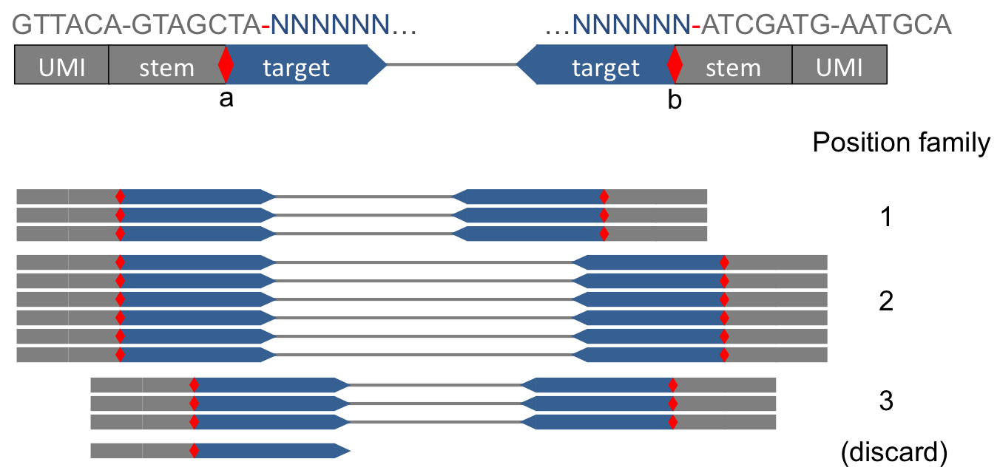
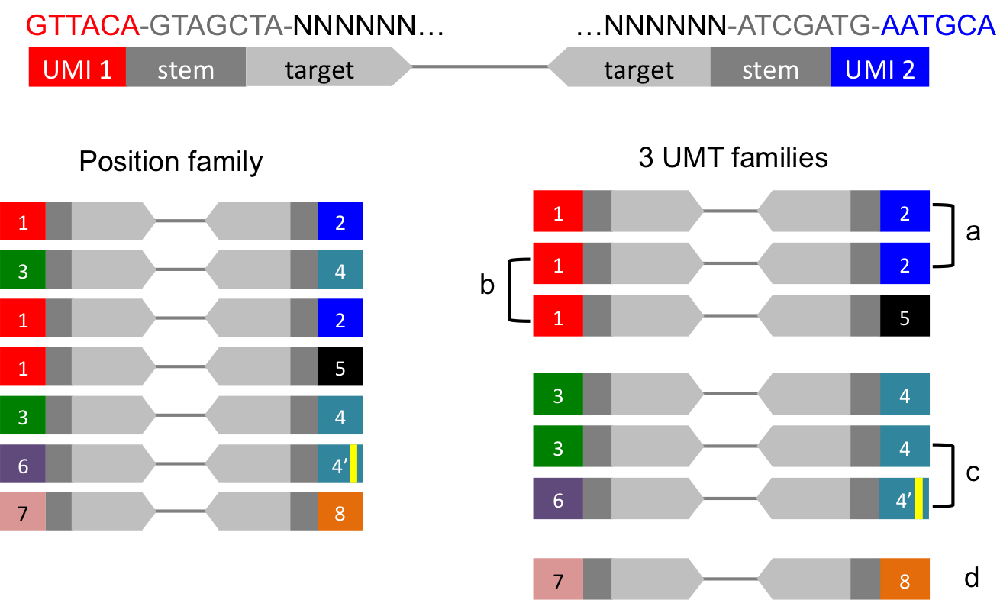
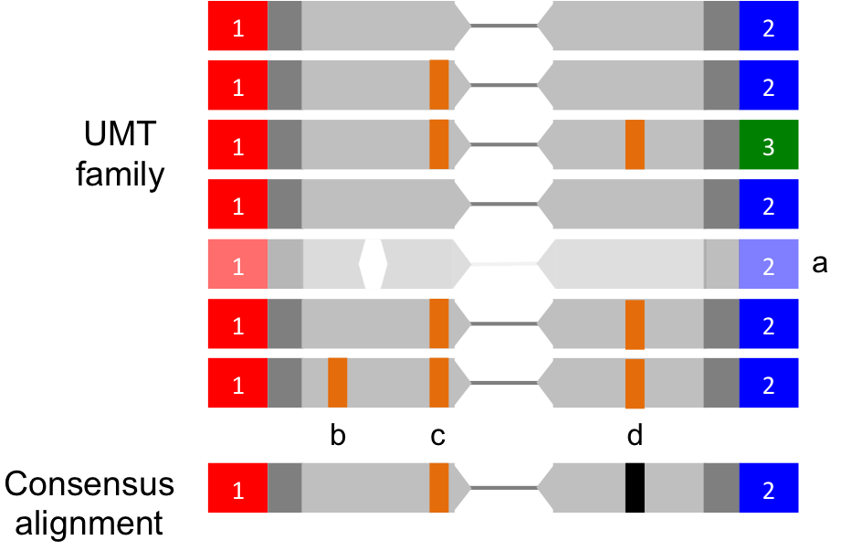

Background
==========

Researchers are increasingly searching for low frequency variants in
diverse genomic populations using deep coverage, next-generation
sequencing data [1-5]. Errors during PCR amplification and sequence base
calling can increase the false positive rate and complicate the
identification of true biological variants. In response, a number of
researchers have introduced DNA tagging methods. By adding a
molecule-specific DNA sequence prior to steps involving amplification,
PCR duplicates can be identified and utilized to reconstruct the
sequence of the original biological molecule. This allows the
partitioning of PCR and sequencing errors from true, low frequency
variants.

The bioinformatic analysis tool Connor de-duplicates a tagged BAM file
and produces a BAM file with consensus alignment pairs that represent
the original biological molecules. In terms of data workflow, Connor is
similar to position-based deduplication (e.g. Picard MarkDuplicates [6])
with changes to address two major challenges. These challenges are (1)
biological duplication can not easily be distinguished from PCR
duplication in regions of ultra-deep coverage (2) consensus sequences
that match the reference genome are typically chosen over the sequences
containing variants. To address these challenges, Connor combines
sequences where the alignment structure and molecular tags match,
creating consensus sequences that model the original molecules.

Workflow
========

Connor accepts a barcoded, paired alignment file (BAM), groups those
input alignments into families, combines each family into a consensus
alignment, and emits the set of deduplicated, consensus alignments
(BAM).

    Sequencing [FASTQ 1/2] -> Aligner [BAM] -> Connor [BAM] -> Variant
    Detection [VCF]

Each consensus alignment represents a set of original paired reads which
share the same position and same barcode; however not all alignments are
used to derive the consensus BAM. Some alignments cannot be placed into
a consensus family because they are not aligned, are not properly
paired, have low mapping quality, etc. Also some alignments can be
placed into a family but are discarded because they have an anomalous
CIGAR value. Finally, whole consensus families may be discarded because
they contain too few original reads (by default families with fewer than
3 reads are excluded). Statistics on unplaced and discarded alignments
are listed in the Connor log output. Also, Connor can optionally emit an
“annotated” BAM whose alignments match the input BAM alignments with
additional BAM tags that describe how each alignment was grouped into
families or why it was filtered out.

Connor assumes the input BAM files are tagged using the Rubicon
Genomics’ ThruPLEX\ :sup:`®` Tag-seq Kit. In particular, Connor assumes
each query sequence begins with a 6 nucleotide unique molecular tag
(UMT), followed by an 8 to11 nucleotide non-random stem sequence and the
target sequence region. The aligner must preserve the leading UMT and
stem sequences and mark those areas as "soft clipped" in the BAM CIGAR
field to indicate they did not match the reference; this is default
behavior for some aligners (e.g. Burrows-Wheeler Aligner, BWA [7]).

+--------------------+-----------------------+-------------------+---------------------------+
|     **region**     |     **UMT barcode**   |     **stem**      |     **target sequence**   |
+====================+=======================+===================+===========================+
|     **sequence**   |     ACTGTT            |     GTAGCTCA      |     GTTGAGACACAT...       |
+--------------------+-----------------------+-------------------+---------------------------+
|     **CIGAR**      |     soft clipped      |     matches ref   |
+--------------------+-----------------------+-------------------+---------------------------+

Because a correct UMT and consistent alignment structure are integral to
Connor’s ability to accurately deduplicate, **avoid any manipulations
between sequencing, alignment and deduplication**. Examples of
problematic manipulations include:

-  **End Trimming**: Removes base calls from the front of the sequence
   (the location of the UMT barcode), which would prevent affected reads
   from being correctly grouped.

-  **Pre-alignment Quality Trimming**: Removes reads from the end of the
   sequence creating distinct CIGAR values obscuring the original
   alignment structure

Connor has been tested with the following aligners (using default
parameters except where noted):

-  BWA v. 0.7.12 [7]

-  Bowtie2 v. 2.2.4 (-local mode) [8]

-  DNASTAR SeqMan NGen v.13.0.2.2 (disable clipping and deduplication)
   [9]

-  Hisat2 v.2.0.4 [10]

-  Novoalign v.3.04.06 [11]

**Installation Requirements**

Connor requires Python 2.7 or later and has been tested with:

-  Python 2.7 and 3.4

-  pysam 0.8.4 and 0.9.0 [12,13]

-  OSX

-  Unix RHEL6/7

Connor does not work in Windows OS because it depends on the python
library pysam, which is not supported on Windows.

**
**

Overview of Connor’s UMT Deduplication Method
=============================================

1. Discard alignments that could not be mapped, are not properly paired,
   have low mapping quality (<1), or are missing CIGAR value

2. Discard alignments whose pair partner is missing

3. Group together alignment pairs which share the same stem-template
   edge coordinates into “position families” (Fig. 1)

4. Based on left and right UMT, subdivide each “position family” into
   “UMT families” (Fig. 2)

   a. Extract left + right (combined 12-mer) UMT and sort by frequency
      into candidate UMT families

   b. For each alignment pair, loop over candidate family (in descending
      popularity) comparing the alignment UMT with the candidate family

      -  Exact match across 12-mers is considered a match

      -  Exact match of left *or* right UMT (6-mer) is considered a
         match

      -  *Inexact* match (within a user-defined Hamming distance,
         default=1) of left or right UMT is considered a match

   c. Each alignment pair will either match an existing UMT family or
      create its own family

5. Within each UMT family, establish the majority CIGAR across
   alignments; discard alignment pairs with non-majority CIGARs

6. Discard UMT families with fewer than a user-defined number of
   original pairs (default=3 pairs)

7. For each UMT family, collapse the set of original alignment pairs
   into a single consensus alignment pair (Fig. 3)

-  Consensus sequence is determined by majority vote at each position in
   the base call sequence

-  Any position with less than a user-defined percent majority
   (default=60%) results in an N at that position

-  Consensus quality is maximum mapping quality for that UMT family

-  Consensus CIGAR is the majority cigar for that UMT family

Figures
=======

**Figure 1: Alignment pairs are grouped into position families**

|fig1_position_families| Reads are grouped into position families based on their
alignment to the reference. Each bar represents a paired alignment
positioned on the reference. The stem-target boundaries of the target
sequences define the groups (beginning of left target, end of the right
target) [a,b]. Unmapped, unpaired, or low-quality reads are removed.

**Figure 2: Position families are subdivided into UMT families**

|fig2_umt_families|

Position families are further divided into families by the UMT. Each bar
represents a paired alignment; distinct UMT’s are numbered and shaded.
The left side shows original alignments from the position family; on the
right those same alignments are partitioned into three UMT families.
Rare anomalies in tagging and PCR processes can erroneously split
families. To prevent spurious family splits, an alignment will be
admitted to a UMT family if it matches either the left or right UMT
barcode exactly, or is within a specified hamming distance. Several
match types are noted: [a] are exact left-right matches, [b] is exact
one-side match, [c] is inexact one-side match. Small families (<3
alignment pairs) are discarded [d].

**
**

**Figure 3: UMT family of alignments are combined into a consensus**

|fig3_consensus|

The set of alignment pairs in a UMT family (top) are combined into a
single consensus pair (bottom) by majority vote. Each bar represents a
paired alignment; distinct UMT are numbered and shaded; mismatches
(candidate variants) in the target sequence region are highlighted.
Within a UMT family, only structurally identical alignments (i.e.
matching CIGAR values) can be combined; alignment pairs with minority
CIGAR values are discarded [a]. Consensus alignment preserves the
majority UMT left and right tag and stem. In the target sequence region,
the base calls are tallied for each position and the majority base call
becomes the consensus base call [b,c]. If the majority base call is less
than the consensus sequence threshold (60% by default), the base call is
replaced by “N” indicating ambiguity [d].

References
==========

1.  Kinde I et al. Detection and quantification of rare mutations with
    massively parallel sequencing. Proc Natl Acad Sci U S A. 2011 Jun
    7;108(23):9530-5.

2.  Peng Q et al. Reducing amplification artifacts in high multiplex
    amplicon sequencing by using molecular barcodes. BMC Genomics 2015
    Aug 7;16:589.

3.  Schmitt MW et al. Detection of ultra-rare mutations by
    next-generation sequencing. Proc Natl Acad Sci U S A. 2012 Sep 4;
    109(36): 14508–14513.

4.  Schmitt MW et al. Sequencing small genomic targets with high
    efficiency and extreme accuracy. Nature Methods 2015 May;
    12(5):423-5.

5.  Ståhlberg A, et al. Simple, multiplexed, PCR-based barcoding of DNA
    enables sensitive mutation detection in liquid biopsies using
    sequencing. Nucl. Acids Res. 2016 Jun 20;44(11):e105.

6.  Picard - A set of tools (in Java) for working with next generation
    sequencing data in the BAM format. http://
    broadinstitute.github.io/picard.

7.  Li H, Durbin R. Fast and accurate short read alignment with
    Burrows-Wheeler transform. Bioinformatics. 2009
    Jul15;25(14):1754-60..

8.  Langmead B, Salzberg SL. Fast gaped-read alignment with Bowtie2. :
    Nat Methods. 2012 Mar 4;9(4):357-9.

9.  DNASTAR SeqMan NGen- Software for Next-Gen Sequence Assembly.
    http://www.dnastar.com/t-nextgen-seqman-ngen.aspx.

10. Kim D, et al. HISAT: a fast spliced aligner with low memory
    requirements. Nat Methods 2015. Apr;12(4):357-80.

11. Novoalign: http://www.novocraft.com/products/novoalign/

12. Pysam: https://github.com/pysam-developers/pysam.

13. Li et al. The Sequence Alignment/Map format and SAMtools.
    Bioinformatics. 2009 Aug 15;25(16):2078-9.

